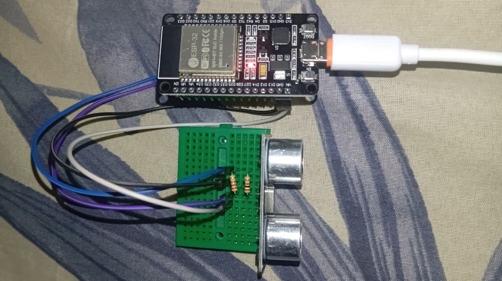
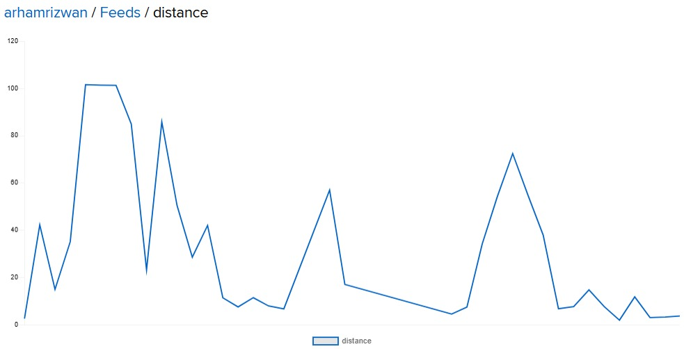

<div align="center">


<br/>


</div>

---

## 📡 Overview

A cloud-connected security telemetry node — an HC-SR04 ultrasonic sensor measures distance, an ESP32 processes it and streams the reading over WiFi via MQTT to an Adafruit IO dashboard for live, remote monitoring.

---

## 🎯 How It Works

```
   HC-SR04 Sensor
        ↓
   [Measure Distance]
        ↓
   [ESP32 Processes]
        ↓
   [Publish via MQTT]
        ↓
   Adafruit IO Dashboard
        ↓
     Live Graph
```

---

## ⚙️ Components

| Component | Role |
|---|---|
| 🔲 ESP32 Dev Board | WiFi-enabled main controller |
| 📏 HC-SR04 | Ultrasonic distance sensor |
| ☁️ Adafruit IO | Cloud data storage & visualization |
| 🔧 Voltage Divider (1kΩ + 2kΩ) | Steps ECHO line down to 3.3V |

---

## 🔌 Wiring

| HC-SR04 | ESP32 |
|---|---|
| VCC | 5V |
| GND | GND |
| TRIG | GPIO 5 |
| ECHO | GPIO 18 *(via voltage divider)* |

📄 Full wiring breakdown → [`docs/wiring_connections.md`](docs/wiring_connections.md)

---

## 🚀 Setup

<details>
<summary><b>Click to expand full setup steps</b></summary>

<br/>

1. **Copy** `secrets.h.example` → `secrets.h` in the same folder
2. **Fill in credentials:**
```cpp
   #define WIFI_SSID "YourNetwork"
   #define WIFI_PASS "YourPassword"
   #define AIO_USERNAME "your_username"
   #define AIO_KEY "your_api_key"
```
3. **Install libraries:**
   - `Adafruit MQTT Library`
   - `PubSubClient`
   - `WiFi` *(built-in)*
4. **Upload sketch** — `code/distance_sensor_mqtt.ino`
5. **Open Serial Monitor** at 115200 baud to view live readings
6. **Add a chart block** to your `distance` feed on the Adafruit IO dashboard

</details>

---

## 📸 Demo

### Setup


### Live Dashboard


*Real-time distance graph, data history, and a mobile-friendly view — all on Adafruit IO.*

---

## 🐛 Troubleshooting

<details>
<summary><b>Common issues & fixes</b></summary>

<br/>

| Issue | Solution |
|---|---|
| No WiFi connection | Check SSID/password in `secrets.h` |
| Data not appearing in Adafruit IO | Verify API key & feed name match |
| Sensor readings inaccurate | Check wiring, ensure 5V supply is stable |
| Reconnect loop / rate-limited | Backoff logic handles this — wait it out, don't spam reconnects |

Full breakdown → [`docs/troubleshooting.md`](docs/troubleshooting.md)

</details>

---

## 💡 Key Concepts

✅ ESP32 WiFi connectivity & MQTT publish/subscribe
✅ Blocking WiFi handshake on boot, non-blocking sensor loop after
✅ `dtostrf()` for safe payload formatting (no heap fragmentation)
✅ Exponential backoff on reconnect to respect Adafruit IO's rate limit

---

## 🔮 Possible Improvements

- 📊 Multiple sensor nodes feeding one dashboard
- 🔔 Threshold alerts (push notification on breach)
- 🔋 Deep-sleep mode between readings for battery operation
- 📱 Custom mobile dashboard instead of default Adafruit IO view

---

<div align="center">

**Author:** Arham Rizwan · 2026


</div>
